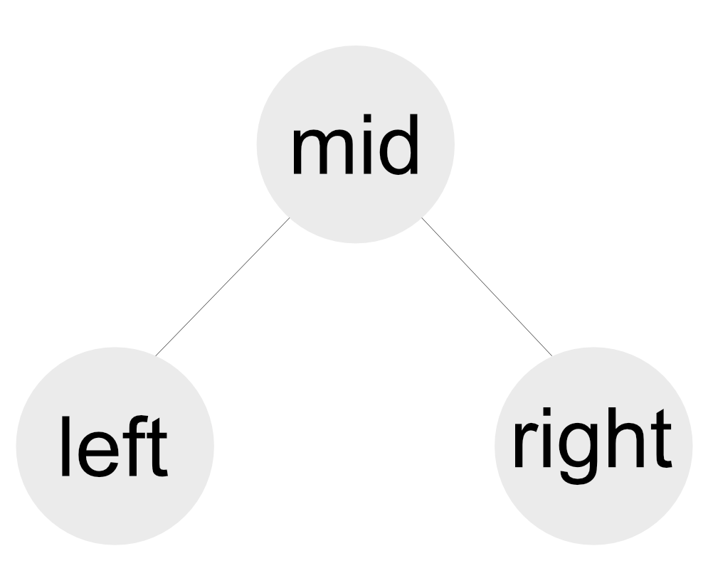

# 이진 탐색 트리

## 배경

어떤 이진 탐색 트리가 있습니다.  
이진 탐색 트리는 아래 그림과같은 트리가 재귀적으로 구성되어있습니다.  

이진 탐색 트리를 순회하는 방법에는 크게 3가지가 존재합니다.  
각 프리오더(pre order), 인오더(in order), 포스트오더(post order)라고 합니다.  
프리오더는 mid -> left -> right 순서로 재귀적으로 순회하는 방식입니다.  
인오더는 left -> mid -> right 순서로 재귀적으로 순회하는 방식입니다.  
포스트오더는 left -> right -> mid 순서로 재귀적으로 순회하는 방식입니다.  
각 순회 방식 중 2가지가 주어지면 원본 이진 트리를 구성할 수 있다고 알려져 있습니다.

## 규칙

1. 원본 데이터는 이진 탐색 트리(Binary Search Tree)로 구성되어 있는 트리입니다.

## 입력

Solution 클래스의 solve 함수는 정수형 배열로 이루어진 프리오더와 인오더를 매개변수로 받습니다.

## 출력

입력받은 프리오더와 인오더를 바탕으로 포스트오더를 만들어 반환합니다.

## 예시

`[1, 2, 3]`와 `[2, 1, 3]`가 프리오더와 인오더로 들어오면 결과로 `[2, 3, 1]`이 반환되어야 합니다.

## 검사

problem 프로젝트의 Solution 클래스의 solve 함수를 작성하고 SolutionTest 클래스의 test 함수를 테스트합니다.
